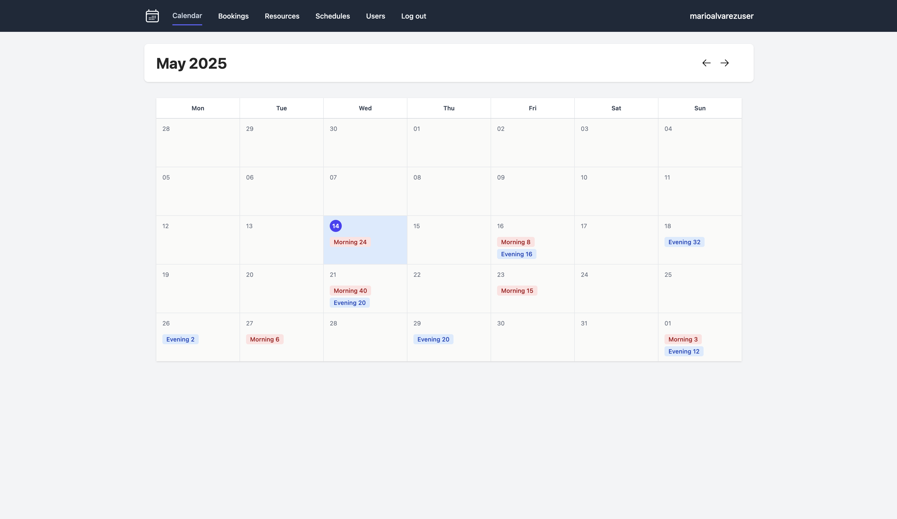
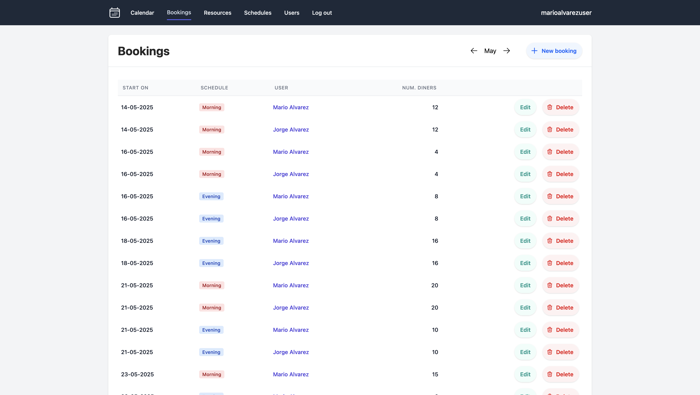
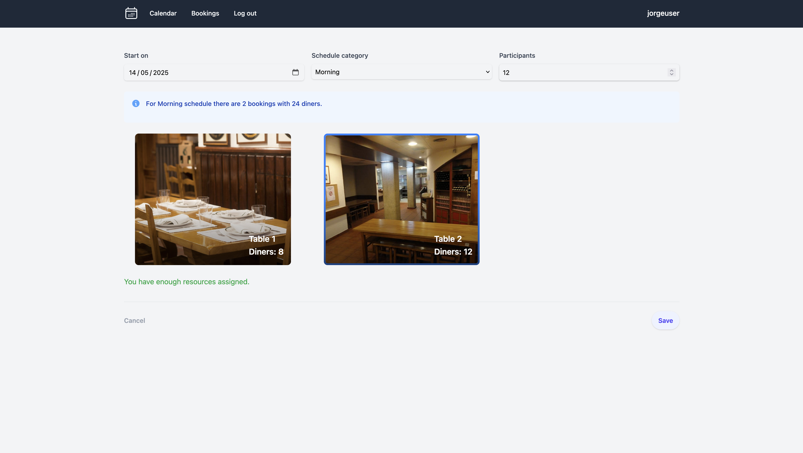
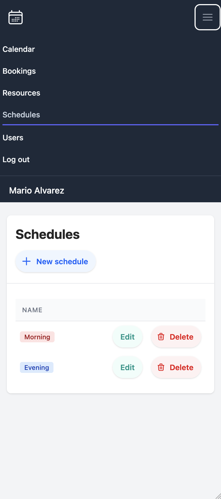

BookingsApp

## 🌟 Descripción General

BookingsApp es una aplicación web desarrollada con el propósito de ofrecer una solución integral para la gestión y reserva de recursos. Aunque inicialmente creada para facilitar la organización en entornos como sociedades gastronómicas, donde la reserva de espacios y elementos compartidos es fundamental, este proyecto, desarrollado como una oportunidad para explorar y aplicar diversas tecnologías y patrones de desarrollo, permite a los administradores definir y gestionar la disponibilidad de elementos como salas de reuniones o herramientas. Los usuarios pueden realizar reservas de manera eficiente a través de una interfaz intuitiva, haciendo de esta una herramienta adaptable a diversos contextos donde la gestión de reservas sea necesaria. Su diseño y funcionalidad buscan ofrecer una experiencia de usuario fluida y práctica

## ✨ Características Principales

* **Gestión de Recursos:** Creación, edición y eliminación de recursos.
* **Gestión de Horarios:** Creación, edición y eliminación de horarios asignables a recursos.
* **Sistema de Reservas:** Interfaz intuitiva para que los usuarios puedan ver la disponibilidad y realizar reservas.
* **Autenticación de Usuarios:** Sistema seguro para que los usuarios puedan registrarse, iniciar sesión y gestionar sus reservas.
* **Panel de Administración:** Interfaz para administradores para gestionar recursos, reservas, horarios y usuarios.
* **Diseño Responsivo:** La interfaz de usuario se adapta fluidamente a diferentes tamaños de pantalla (ordenadores de escritorio, tablets y dispositivos móviles), proporcionando una experiencia consistente en cualquier dispositivo.

## 🖼️ Capturas de Pantalla

